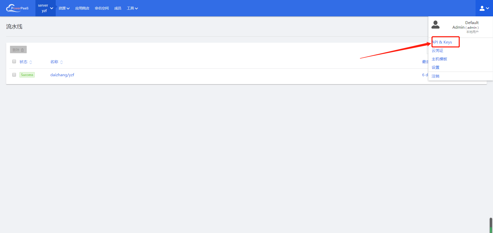
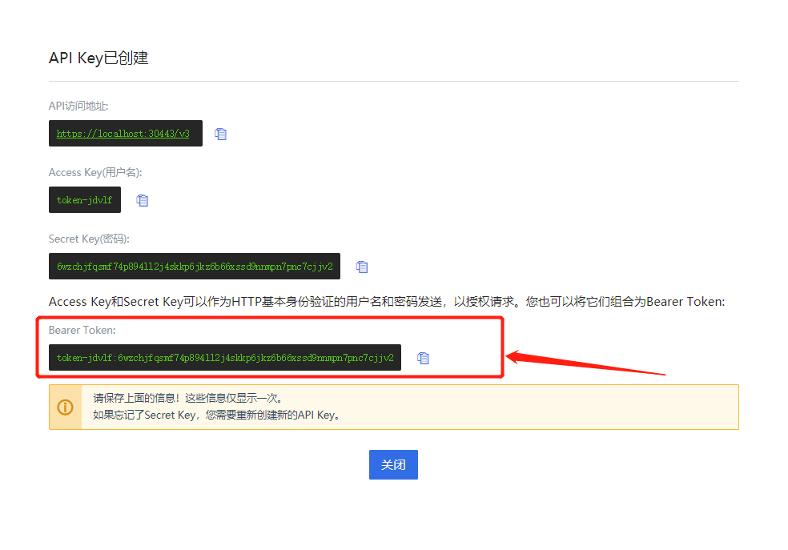
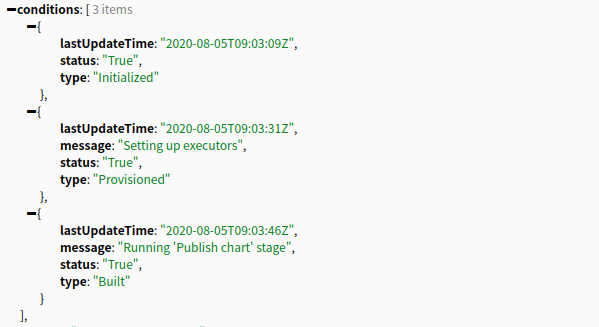
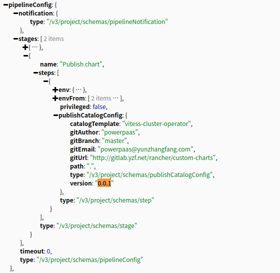
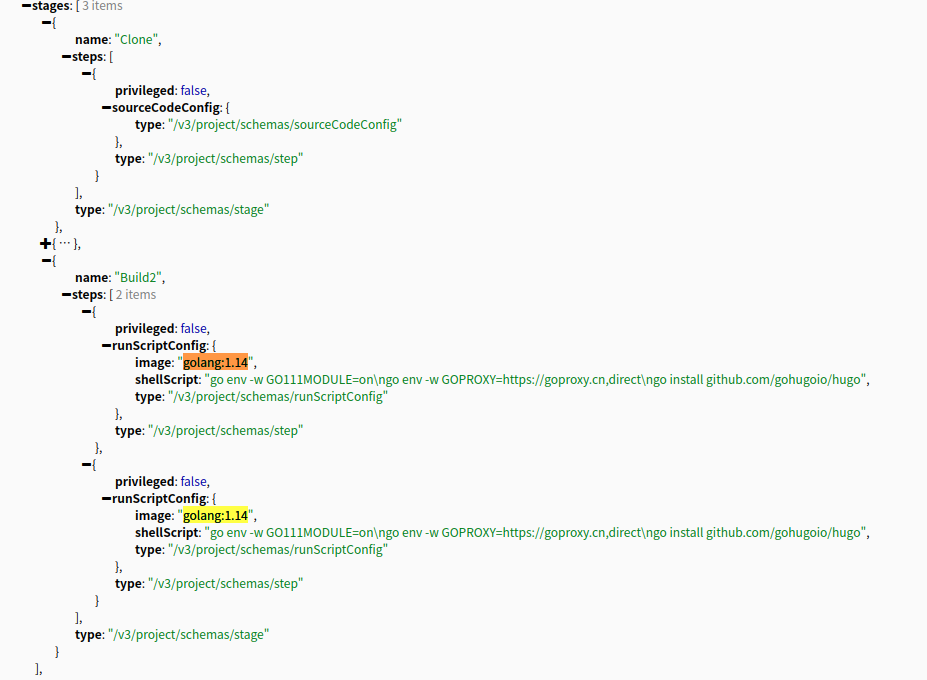
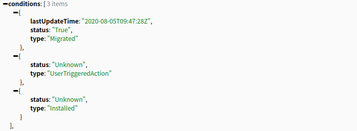

# 对接工单系统的流水线接口设计

## 认证模式

以下按照采用srv4.yzf.best系统为例,采用token认证模式。

1. 创建永久key。


    
(2)　获取永久token。　

    

## 流水线构建接口

1.构建接口。

&nbsp;&nbsp;　格式为: v3/project/{cluster_id}:{project_id}/pipelines/{project_id}:{pipeline_id}?action=run

&nbsp;&nbsp;　https://srv4.yzf.best/v3/project/c-64wdm:p-5tfq9/pipelines/p-5tfq9:p-tpk2x?action=run

&nbsp;&nbsp;　Request Method: POST

&nbsp;&nbsp;　Request Header：　Authorization: Bearer {token}

&nbsp;&nbsp;　Body结构为：　{"branch":"master", "webhook": "http://172.23.20.137:8005/release/querystate"}

&nbsp;&nbsp; Response结果如下，取以下json的“id”值作为以下访问接口使用，后面的10代表流水线id。

```text
    {
        ... ...
    	"id": "p-5tfq9:p-tpk2x-10",
    	"mergeRequestIid": 0,
    	"message": "chnage harbor refer \u0026 correct\n",
    	"name": "p-tpk2x-10",
    	"namespaceId": null,
    	"pipelineId": "p-5tfq9:p-tpk2x",
    	"projectId": "c-64wdm:p-5tfq9",
    	"run": 10,
        ... ...
    	"state": "active",
    	"type": "pipelineExecution",
    	"uuid": "2bd3d01a-dda6-4b3f-a057-69c49bc1c97a"
    }
```

**注意：**

此处的接口是异步的，如果返回200状态码代表提交请求成功。


2.为了获取最终结果，目前提供两种方案：

- 工单系统自生通过轮询来访问相关接口，获取构建状态信息。访问的接口如下：
　
　https://srv4.yzf.best/v3/project/c-64wdm:p-5tfq9/pipelineExecutions/p-5tfq9:p-tpk2x-10

需要的　dockerImage以及version-Tag在返回结果中增加字段实现。增加的字段为"dockerImage","versionTag"，工单系统取这两个字段获取信息。

"conditions"的三个状态，当存在　"type":"Built"并且"status":"True"，那么代表构建已经完成了。


以下是两个不同的流水线项目的运行状态。PAAS提供如下的反馈结果，即“stages”部分，描述了不同构建阶段的构建信息。
第一个包含了"chart version"，第二个包含了"docker imageTag"。





- 待定。


## 发布接口

(1) 以下功能正在调试，后期可能需要做少量改动。

&nbsp;&nbsp;　格式为：　v3/project/{cluster_id}:{project_id}/apps/{project_id}:{deploy-name}

&nbsp;&nbsp;　https://srv4.yzf.best/v3/project/c-64wdm:p-5tfq9/apps/p-5tfq9:project-deploy?action=upgradeoutter

&nbsp;&nbsp;　Request Method: POST

&nbsp;&nbsp;　Body结构为：　{"versionTag": ...}

&nbsp;&nbsp;　Request Header：　Authorization: Bearer {token}

&nbsp;&nbsp; Response结果如下，取condition可以获取到发布状态。


(2) 获取发布日志，依然采用轮询机制。

&nbsp;&nbsp;　https://srv4.yzf.best/v3/project/c-64wdm:p-5tfq9/apps/p-5tfq9:project-deploy

&nbsp;&nbsp;　Request Method: GET

&nbsp;&nbsp;　Request Header：　Authorization: Bearer {token}

&nbsp;&nbsp; Response结果如下，取condition可以获取到发布状态。



(3)当上述发布状态成功之后。提供以下接口暴露Pod日志，正在开发中。轮询方式依次拉取。

&nbsp;&nbsp;　https://srv4.yzf.best/v3/project/c-64wdm:p-5tfq9/deployLogs/p-5tfq9:project-deploy

&nbsp;&nbsp;　Request Method: GET

&nbsp;&nbsp;　Request Header：　Authorization: Bearer {token}
