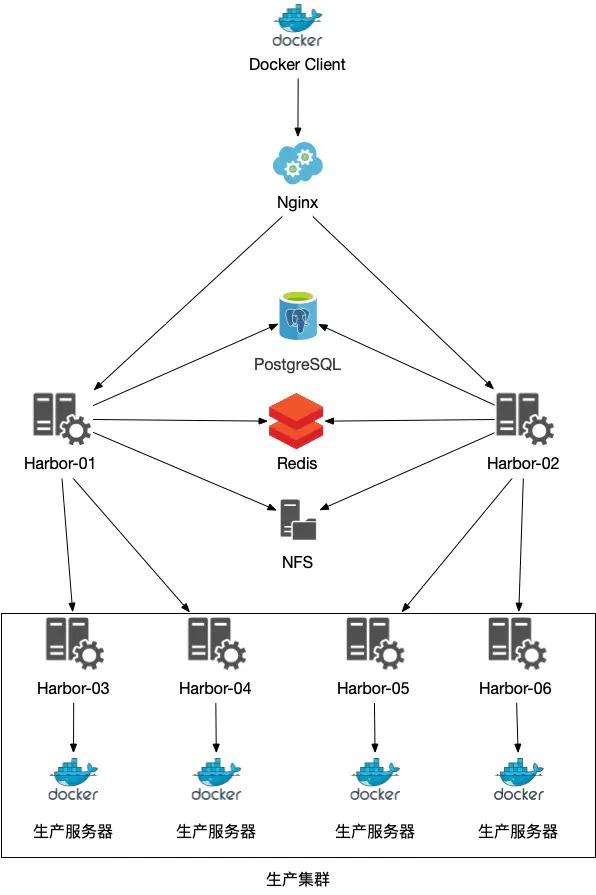

# Harbor生产级别可用 需要支持的配置。

## 1， HTTPS的支持。
   ** 自签证书支持https配置方案，以服务器域名为“harbor.yzf.best”为例。
   - （1）创建一个存放 证书 的目录
           <br/># mkdir -p /data/ssl && cd /data/ssl
      <br/>
     （2）使用 RSA 方式加密, 生成 ca.key (自定义根证书私钥), 长度为 3072
           <br/># openssl genrsa -out ca.key 3072
      <br/>
      (3) 通过 key 生成证书, 有效期为3650天
           <br/># openssl req -new -x509 -days 1095 -key ca.key -out ca.pem
      <br/>
      
   - (1) 生成 harbor主机的证书私钥，对应域名“harbor.yzf.best”
      <br/> # openssl genrsa -out harbor.yzf.best.key 3072
      <br/>
     (2) 生成证书请求
      <br/> # penssl req -new -key harbor.yzf.best.key -out harbor.yzf.best.csr
            <br/> 在**Common Name (eg, your name or your server's hostname) []:** 这一栏 填写“harbor.yzf.best”
            <br/>
     (3) 交付给CA（上述自定义生成）机构进行签名：
      <br/> # openssl x509 -req -in harbor.yzf.best.csr -CA ca.pem -CAkey ca.key -CAcreateserial -out harbor.yzf.best.pem -days 3650
      
   - 可以确认一下 harbor.yzf.best.pem 这个证书的内容
      <br/># openssl x509 -noout -text -in harbor.yzf.best.pem
      
   - 由于这个 CA证书是通过自签发的，其他机器不会信任，可以将ca.pem分发到其他机器上。
     <br/> # cp ca.pem /etc/pki/ca-trust/source/anchors/
     <br/> # update-ca-trust enable
     <br/> # update-ca-trust extract

   - 接下来，将上述生成的 harbor.yzf.best.key以及harbor.yzf.best.pem拷贝到 /etc/ssl/harbor/。
     并且配置如下：
     
     修改harbor.yml文件，注释掉http相关配置，并且写入如下配置：
```text
     https:          // 使用 https
     # # https port for harbor, default is 443
         port: 443
         certificate: /etc/ssl/harbor/harbor.yzf.best.pem
         private_key: /etc/ssl/harbor/harbor.yzf.best.key
```


## 2, 高可用架构划分。
**对harbor中的组件根据有/无状态进行划分**

无状态组件：
- Proxy
- Core
- Registry
- Jobservice
- Logs
- Clair
- Notary

有状态组件：
- PostgreSQL
- Redis
- Registry

部署思路： 无状态应用按照单体方式启动多套，有状态应用可以交付运维进行数据层面的统一管理。


## 3, 高可用部署方案
本次搭建以NFS作为共享存储存放Harbor相关data，并分离PostgreSQL与Redis为多个Harbor共同连接使用，使用Nginx做负载均衡。
。

如果最终生产环境集群中服务器较多，依赖做完LB的Harbor也无法完全达到需求时，可以使用如下架构，部署下级Harbor节点从主节点同步镜像，然后再分发给生产服务器。



- 1, 部署外置 PostgreSQL以及Redis数据库。
  根据需求可以配置外置数据库，或者还是通过 docker-compose安装得到数据库。
  
  一般Harbor完全安装需要4个 PostgreSQL数据库（当然也可以合并为1个），以下是docker-compose在一台宿主机上的部署方案。
  需要
```text
    version: "3"
    
    networks:
      harbor:
        driver: bridge
    
    services:
      registry:
        image: postgres:9.6.14
        container_name: harbor-registry
        restart: always
        environment:
          POSTGRES_DB: registry
          POSTGRES_PASSWORD: root123
        volumes:
          - $PWD/postgres/registry:/var/lib/postgresql/data
        networks:
          - harbor
        ports:
          - 20010:5432
      clair:
        image: postgres:9.6.14
        container_name: harbor-clair
        restart: always
        environment:
          POSTGRES_DB: clair
          POSTGRES_PASSWORD: root123
        volumes:
          - $PWD/postgres/clair:/var/lib/postgresql/data
        networks:
          - harbor
        ports:
          - 20011:5432
      notarysigner:
        image: postgres:9.6.14
        container_name: harbor-notarysigner
        restart: always
        environment:
          POSTGRES_DB: notarysigner
          POSTGRES_PASSWORD: root123
        volumes:
          - $PWD/postgres/notarysigner:/var/lib/postgresql/data
        networks:
          - harbor
        ports:
          - 20012:5432
      notaryserver:
        image: postgres:9.6.14
        container_name: harbor-notaryserver
        restart: always
        environment:
          POSTGRES_DB: notaryserver
          POSTGRES_PASSWORD: root123
        volumes:
          - $PWD/postgres/notaryserver:/var/lib/postgresql/data
        networks:
          - harbor
        ports:
          - 20013:5432
      Redis:
        image: redis:4.0.10
        container_name: harbor-redis
        command: redis-server /usr/local/etc/redis/redis.conf
        restart: always
        volumes:
          - $PWD/redis/data:/data
          - $PWD/redis/redis.conf:/usr/local/etc/redis/redis.conf
        networks:
          - harbor
        ports:
          - 20000:6379
          
    # 开启防火墙
``` 
  
- 2 ， 通过NFS服务将Harbor的一些配置文件共享到远程存储。

- 3 ， 依照单体部署方案部署harbor，主要更改harbor.yml文件，由于我们这里使用外置PostgreSQL与Redis所以直接注释掉database相关配置改用external_database与external_redis。
```text
# Harbor DB配置，由于使用外部数据库，所以这里我们注释掉
# database:
#   password: root123
#   max_idle_conns: 50
#   max_open_conns: 100
...
# 外部PostgreSQL，由于Harbor使用了4个数据库，这里我们也需要对相应数据库地址进行配置
    external_database:
      harbor:
        host: 10.10.1.10
        port: 20010
        db_name: registry
        username: postgres
        password: root123
        ssl_mode: disable
        max_idle_conns: 2
        max_open_conns: 0
      clair:
        host: 10.10.1.10
        port: 20011
        db_name: clair
        username: postgres
        password: root123
        ssl_mode: disable
      notary_signer:
        host: 10.10.1.10
        port: 20012
        db_name: notarysigner
        username: postgres
        password: root123
        ssl_mode: disable
      notary_server:
        host: 10.10.1.10
        port: 20013
        db_name: notaryserver
        username: postgres
        password: root123
        ssl_mode: disable
    # 使用外部Redis，取消相应注释即可
    external_redis:
      host: 10.10.1.10
      port: 20000
      password:
      registry_db_index: 1
      jobservice_db_index: 2
      chartmuseum_db_index: 3
```


- 4, Nginx。
这里的Nginx将代理Harbor组件的 goharbor/nginx-photon镜像启动的Nginx服务器，当然在生产环境更推荐使用SLB做负载均衡。

nginx配置可以参照如下：

```text
    upstream harbor {
        ip_hash;
        server [harbor-1]:80;
        server [harbor-2]:80;
    }
    server {
       listen       80;
       # 提供访问的域名或者IP
       server_name  harbor.yourdomain.com;
       return      308 https://$host$request_uri;
    }
    server {
        listen  443 ssl;
        server_name harbor.yourdomain.com;
        
        # SSL 证书
        ssl_certificate ./certs/harbor.crt;
        # SSL 私钥
        ssl_certificate_key ./certs/harbor.key;
        client_max_body_size 0;
        chunked_transfer_encoding on;
    
        location / {
            proxy_set_header X-Forwarded-For $proxy_add_x_forwarded_for;
            proxy_set_header Host $host;
            proxy_set_header X-Forwarded-Proto https;
            proxy_redirect off;
            proxy_ssl_verify off;
            proxy_ssl_session_reuse on;
            proxy_pass http://harbor;
            proxy_http_version 1.1;
    }
        location /v2/ {
            proxy_pass http://harbor/v2/;
            proxy_set_header Host $host;
            proxy_set_header X-Real-IP $remote_addr;
            proxy_set_header X-Forwarded-For $proxy_add_x_forwarded_for;
            proxy_set_header X-Forwarded-Proto $scheme;
            proxy_ssl_verify off;
            proxy_ssl_session_reuse on;
            proxy_buffering off;
            proxy_request_buffering off;
        }
    }
    复制代码
    
    启动Nginx
    
    验证Nginx配置正确性
    
    # nginx -t
    复制代码
    
    平滑重启Nginx
    
    # nginx -s reload
    复制代码
    
    开放防火墙80/443端口
    
    # firewall-cmd --zone=public --permanent --add-port=80/tcp
    # firewall-cmd --zone=public --permanent --add-port=443/tcp
    # firewall-cmd --reload
```
