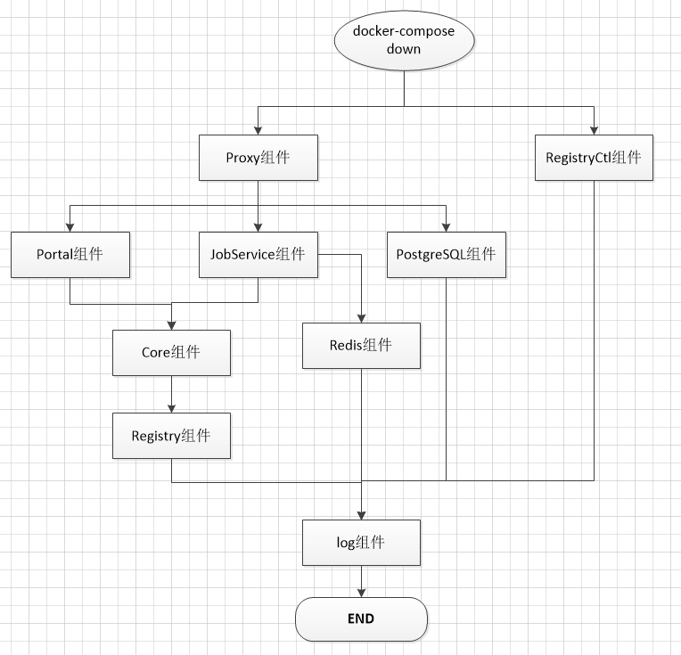

# harbor升级风险评估

　　此次分析的重点通过分析通过docker-compose安装的单体Harbor应用，在单体架构下必然需要停机维护，但是尽量控制停机时间。略微涉及到高可用架构下的不停机平滑升级。
  
　　风险涉及到客户端是否可控、有状态应用（表现在数据存储方面）、停止服务的顺序以及是否优雅，从这三个方面进行分析。 

  
## 一,连接Harbor的客户端。
   根据 [架构图](./harbor-upgrate.md) 可以明确，访问是通过Proxy(Nginx)组件作为反向代理，不同的请求通过不同的组件进行处理。
   
1. 维护人员通过浏览器访问。

　　这里主要涉及到 Proxy组件，Portal组件，Core组件；通过浏览器访问的在可控制范围内，在集群升级维护时可以通过邮件通知禁止大家访问。
2. 运行在K8s集群的容器拉取镜像。

　　这里涉及到 Proxy组件，Core组件鉴权，Registry组件； 这里容器的生命周期管理不可控，因此这里是风险点。
3. 通过Powerpass平台构建推送镜像。

　　这里主要涉及到 Proxy组件，Core组件鉴权，Registry组件；风险是可控的。
4. 其他镜像仓库开启的和升级的Harbor仓库的同步功能。

　　这里主要涉及到 Proxy组件，Core组件鉴权，Registry组件；当配置了合理的同步规则时风险可用，在保证强一致性时风险不可控。

   
## 二，有状态应用（数据存储方面）
   总则： 升级风险，在升级过程中可能涉及到数据库结构变更，因此必须要备份数据以便回滚。
   
   1，**基础数据存储**（认证授权数据、审计数据、资源管理相关数据）
   
   存放在harbor-db组件中，就是一个PostgreSQL数据库，当前采用默认配置项，
   挂载在本地  /data/database 目录下。
   
   　　**风险等级**: 高。 尤其是PostgreSQL的元数据也存放在这里，一旦损坏，那么整个应用将会瘫痪并且永久丢失数据。
   
   　　**解决方案**: 首先在单独的宿主机上部署 PostgreSQL应用，这样保证与应用的隔离，这是稳定性的保障；
   
   PostgreSQL的架构可以采用主从模式，数据层面的维护管理以及备份交付专业的运维。
   
   
   2，**镜像数据存储**（通过docker push，以及其他仓库同步过来的数据）
   
   通过Registry组件存放。
   挂载在本地  /data/registry 目录下。
   
   　　**风险等级**: 高。 
   
   　　**解决方案**: （1）部署备用harbor进行数据同步。 （2）通过远程存储备份此目录下的数据。
   
   3，**Redis缓存**
   
   通过registry组件存储。
   挂载在本地 /data/redis 目录下，采用RDB存储方式，这种存储方式的优势在于性能，缺点是意外宕机时数据的可能丢失。
   
   　　**风险等级**: 低。 
   
   4，Jod Service组件收集的日志，记录镜像数据同步信息。
   挂载在本地 /data/job_logs 目录下。
   
   　　**风险等级**: 低。
   
   
   5，harbor-log组件收集的所有组件的日志。
   
   挂载在本地  /var/log/harbor/ 目录下，这是非常有用的日志。默认docker-compose通过syslog驱动存储(或者json-file方式)，
   需要在服务器开启syslog服务才可以存储数据，配置方式如下。
```text
     1. #vim /etc/rsyslog.conf       去掉下面4行前面的#号注释符.   (开启tcp和udp接受)
        module(load="imudp")
        input(type="imudp" port="514")
    
        module(load="imtcp")
        input(type="imtcp" port="514")
    
    
     2. #vim /etc/default/rsyslog.   (-r 允许接受外来日志消息. -x 禁用掉dns记录项不够齐全或其他的日志中心的日志)
        RSYSLOGD_OPTIONS=”-c5 -r -x”
    
        保存退出
    
     3. 重启rsyslog
        #systemctl restart rsyslog
    
     4. 查看其是否启动
        #netstat -nultp | grep 514
    
     5,  进入 /var/log/harbor目录，根据 docker-compose.yaml 文件"logging-driver-tag"定位具体组件的日志信息。
```
   
   　　**风险等级**: 中。
   
   　　**解决方案**: 建议通过logstash收集进ElasticSearch，为后续定位分析问题提供支撑。


## 三，停止服务的顺序以及是否优雅。
- 1，服务停止。
  
  通过 docker-compose down 停止服务。
  
  
- 2，服务停止顺序。

　下图根据docker-compose.yaml文件描述的依赖关系绘制的停止顺序图。（当PostgreSQL和Redis独立部署时可以把下图中的这两个组件去除掉）


- 3，各个组件优雅停止逻辑。

  保证各个组件优雅停止是为了保证在最后一个请求提交过来，所有的组件都能够将请求处理完成再关闭，这样避免出现脏数据以及不一致的数据。

  这一部分需要查看各个组件相关代码作进一步确认。
   
  比较通用的处理逻辑是，先停止Proxy组件（Nginx），然后等待１Min左右的时间，再按照依赖关闭其他组件。