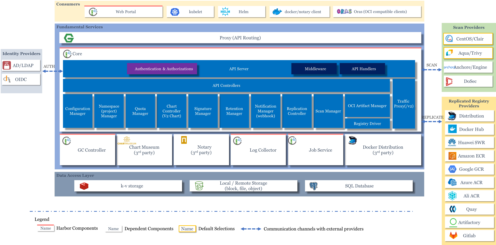

# Harbor 架构解析以及模块拆分

 

 

## 架构原理图以及模块拆分

**&nbsp;&nbsp;对照上图分析主要模块：**
  
- 1,**Proxy**：对应启动组件nginx。它是一个nginx反向代理，代理Notary client（镜像认证）、Docker client（镜像上传下载等）和浏览器的访问请求（Core Service）给后端的各服务；
在docker-compose.yaml文件中对应“goharbor/nginx-photon”镜像。
- 2，**Core**：底层数据存储更新为PostgreSQL数据库，在docker-compose.yaml文件中对应“goharbor/harbor-core”镜像。
   主要提供了四个子功能：

  - API：Harbor暴露的API服务；
  - Auth：用户认证服务，decode后的token中的用户信息在这里进行认证；auth后端可以接db、ldap、uaa三种认证实现；
  - Token服务： 即采用OAuth2协议的做法，如果从docker client发送给registry的请求没有带token，registry会重定向请求到token服务创建token。
    具体的OAuth2处理过程参见：，在配置多镜像仓库源时，理解此过程非常重要。
  - Manager: 划分的资源管理项目。
    
- 3，**Portal**组件：
    前端代码组件，在v1.8.0以后，前端代码单独部署为一个应用。
      对应docker-compose.yaml文件中 “goharbor/harbor-portal”镜像。
    
- 4，**Registry**：负责存储镜像文件，和处理镜像的pull/push命令。Harbor对镜像进行强制的访问控制，Registry会将客户端的每个pull、push请求重新定位到Core Service服务，由此服务验证权限有效性，验证通过返回Token，而后docker client再次携带Token向Registry发送pull/push请求。
     对应docker-compose.yaml文件中 “goharbor/registry-photon”镜像。
     认证授权OAuth2协议在 docker client以及Registry的流程具体参考 [doc](http://www.think-foundry.com/architecture-of-harbor-an-open-source-enterprise-class-registry-server/) 

- 5，**Job Sevice**：负责镜像复制工作的，和其他registry通信，从一个registry pull镜像然后push到另一个registry，并记录job_log；
     对应docker-compose.yaml文件中 “goharbor/harbor-jobservice”镜像。

- 6, **Log Collector**：日志汇总组件，通过docker的log-driver把日志汇总到一起；
     对应docker-compose.yaml文件中 “goharbor/harbor-log”镜像。

- 7, **DB**：负责存储project、 user、 role、replication、image_scan、access等的metadata数据，使用了postgresql数据库。
     对应docker-compose.yaml文件中 “goharbor/harbor-db”镜像。
    

- 8, **Notary**：对应启动组件notary。负责镜像认证,用来保证镜像在 pull , push 和传输过程中的一致性和完整性, 避免中间人攻击, 避免非法的镜像更新和运行。
       通过 install.sh --with-notary 指定安装。
     
- 9，**Scan Providers**： 主要对应组件clair。负责镜像扫描，漏洞扫描功能(可以设置漏洞级别, 当漏洞级别达到一定程度时, 限制镜像的拉取)，是coreos开源的容器漏洞扫描工具，目前还没有具体验证使用。
       通过 install.sh  --with-clair 指定安装。
     
- 10，**存储**
     在v1.8.0后续版本中，存储也作为容器运行。
     
     redis组件： 对应docker-compose.yaml文件中 “goharbor/redis-photon”镜像。
     
     harbor-db组件： 对应docker-compose.yaml文件中 “goharbor/harbor-db“镜像。
     
  
## 升级方案

## 回滚方案  
  
     
## 附：
参考老版本的各组件逻辑关系：

.png)
  
  
docker pull powerpaasharbor.yunzhangfang.com:1180/rancher/busybox:latest