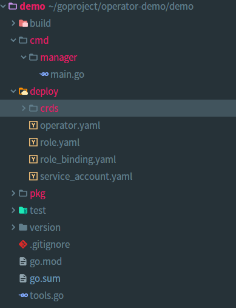
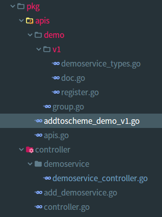
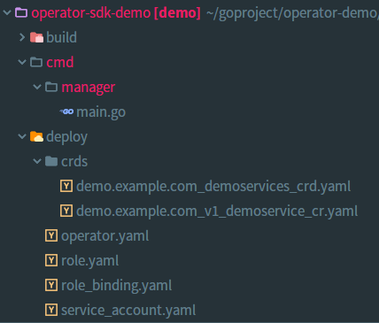
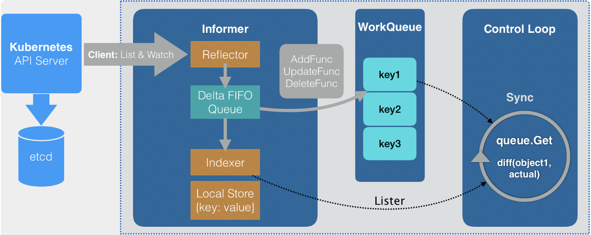

# operator-sdk Demo示例


## 通用操作

- 1， 官方文档链接。

  [https://v1-0-x.sdk.operatorframework.io/docs/building-operators/golang/quickstart/](https://v1-0-x.sdk.operatorframework.io/docs/building-operators/golang/quickstart/)

  值得注意的是，operator-sdk v1.0已经支持了Admission Webhook, 生成方式与下面采用的v0.18略微存在差距。
   
   
- 2， 基于operator-sdk操作步骤。
  
   - 生成一个新项目
       ```text
          #operator-sdk new demo --repo=github.com/example/demo
    
          生成的代码结构如下所示：
          cmd - 包含 main.go 文件，使用 operator-sdk API 初始化和启动当前 Operator 的入口。
          deploy - 包含一组用于在 Kubernetes 集群上进行部署的通用的 Kubernetes 资源清单文件。
          pkg/apis - 包含定义的 API 和自定义资源（CRD）的目录树，这些文件允许 sdk 为 CRD 生成代码并注册对应的类型，以便正确解码自定义资源对象。
          pkg/controller - 用于编写所有的操作业务逻辑的地方
       ```
   
       
  
   - 添加API并且生成控制器
        ```text
           #operator-sdk add api --api-version=demo.example.com/v1 --kind=DemoService
            
            这一步自动生成如下所示的代码结构，存储在 pkg/apis/demo/v1/demoservice_types.go：
                type DemoService struct {
                    metav1.TypeMeta   `json:",inline"`
                    metav1.ObjectMeta `json:"metadata,omitempty"`
                
                    Spec   DemoServiceSpec   `json:"spec,omitempty"`
                    Status DemoServiceStatus `json:"status,omitempty"`
                }  
       
           #operator-sdk add controller --api-version=demo.example.com/v1 --kind=DemoService
        ```
    
        
   
   - 修改自定义资源DemoService的属性值，代码生成。
        ```text
            // 生成CRD-yaml，存储于deploy/crds路径下
            #operator-sdk generate crd
    
            // 生成zz_generated相关DeepCopy代码
            #operator-sdk generate k8s  
        ```
    
  - 生成operator-Docker镜像，部署在集群内部。
        ```text
            //生成本地的构建镜像
            #operator-sdk build vitess/demo-operator:v1.0
        
            //参照如下deploy目录进行部署
            // 部署CRD
            #kubectl apply -f deploy/crds/demo.example.com_demoservices_crd.yaml
        
            // 部署operator
            #kubectl apply -f deploy/*.yaml
        ```
    
    
- 3，controller中Reconcile函数使用细节。
    
    通过operator-sdk add controller生成的控制器，将会生成对应资源的Reconcile函数，具体的调谐逻辑在这个函数里面完成。
    本例子生成的Reconcile如下所示：
    
    ```text
      func (r *ReconcileDemoService) Reconcile(request reconcile.Request) (reconcile.Result, error)
    ```
    
    这个函数就是controller的处理部分，关注其接收参数以及返回值，这部分处理逻辑就是对应下图中controll-Loop的代码。
    
    
    
    参照原生的client-go的使用说明，项目地址 [https://github.com/kubernetes/client-go/tree/master/examples/workqueue](https://github.com/kubernetes/client-go/tree/master/examples/workqueue)：
    
    ```text
         以下代码是client-go官方编程范式。
         (1)创建controller对象
         type Controller struct {
            // kubeclientset is a standard kubernetes clientset
            kubeclientset kubernetes.Interface
            // networkclientset is a clientset for our own API group
            networkclientset clientset.Interface
         
            networksLister listers.NetworkLister
            networksSynced cache.InformerSynced
         
            // workqueue is a rate limited work queue. This is used to queue work to be
            // processed instead of performing it as soon as a change happens. This
            // means we can ensure we only process a fixed amount of resources at a
            // time, and makes it easy to ensure we are never processing the same item
            // simultaneously in two different workers.
            workqueue workqueue.RateLimitingInterface
            // recorder is an event recorder for recording Event resources to the
            // Kubernetes API.
            recorder record.EventRecorder
         }
       
          ...
         fun NewController(kubeclientset kubernetes.Interface,
                          	networkclientset clientset.Interface,
                          	networkInformer informers.NetworkInformer) *Controller {
             ...
             controller := &Controller{
             		kubeclientset:    kubeclientset,
             		networkclientset: networkclientset,
             		networksLister:   networkInformer.Lister(),
             		networksSynced:   networkInformer.Informer().HasSynced,
             		workqueue:        workqueue.NewNamedRateLimitingQueue(workqueue.DefaultControllerRateLimiter(), "Networks"),
             		recorder:         recorder,
             }
             
         }
       
     
         (2) 调用controller Run方法
         func (c *Controller) Run(threadiness int, stopCh <-chan struct{}) error {
          	...
      
            //等待informer完成一次本地缓存的数据同步操作
            if ok := cache.WaitForCacheSync(stopCh, c.networksSynced); !ok {
                return fmt.Errorf("failed to wait for caches to sync")
            }
          	
          	// 通过这里的 threadiness可以设置启动的并发任务的数量。
          	for i := 0; i < threadiness; i++ {
          		go wait.Until(c.runWorker, time.Second, stopCh)
          	}
          
          	...
         }
       
         (3) runWorker的循环处理。
          func (c *Controller) runWorker() {
            for c.processNextWorkItem() {

            }    
          }
        
          func (c *Controller) processNextWorkItem() bool {
            obj, shutdown := c.workqueue.Get()
            
            ...
            
            err := func(obj interface{}) error {
              ...
              if err := c.syncHandler(key); err != nil {
               return fmt.Errorf("error syncing '%s': %s", key, err.Error())
              }
              
              c.workqueue.Forget(obj)
              ...
              return nil
            }(obj)
            
            // 针对err执行相应策略，比如重新存入workqueue，或者延迟一定时间在存入workqueue
            ...
          }
        
          // 具体的实现逻辑在syncHandler,这个key参数是“namespace/name”    
          func syncHandler(key string)error{
          }
        
    ```
    我们关注Reconcile函数，这个函数的接收参数reconcile.Request，是一个封装了"namespace"和"name"的结构体。
    
    其次关注返回值，重点在于是否需要requeue
    ```text
       //1  Reconcile successful - don't requeue
       //   return reconcile.Result{}, nil
       //2  Reconcile failed due to error - requeue
       //   return reconcile.Result{}, err
       //3  Requeue for any reason other than error
       //   return reconcile.Result{Requeue: true}, nil 或者 RequeueAfter: time.Second*5
    ```
    
- 4，代码生成细节。
    
    - 常用代码生成注解。
      
      - // +kubebuilder:resource:path=demoservices,scope=Namespaced
        
        指定此资源对象是cluster资源范围的。
         
      - // +kubebuilder:validation:Maximum=10
      
        // +kubebuilder:validation:Minimum=1
        
        // +kubebuilder:validation:ExclusiveMinimum=true
        
        上述注解标记资源的最大值是10，最小值是1，创建资源（CR）会进行相关的Validation。

      - // +kubebuilder:validation:Enum=True;False;Unknown
      
        指明资源属性是枚举值，只能是True、False或者Unknown。
        
      - // +kubebuilder:validation:MinLength=1
        
        // +kubebuilder:validation:Pattern=^[a-z0-9]([a-z0-9]*[a-z0-9])?$
        
        指明资源属性只能按照正则式的规则进行匹配。
        
      - // +kubebuilder:validation:EmbeddedResource
      
        Affinity *corev1.Affinity `json:"affinity,omitempty"`
        
        指明按照k8s内嵌资源生成。在k8s-v.16版本中无法通过验证。
        
        
## 结合client-go进行比较，理解operator-sdk到底进行了哪些封装以及操作简化。
  
- 传统client-go编写自定义资源的步骤如下。

    - 1，定义types类型。
    
        比如定义一个目录api/types/v1alpha1，里面是关于types的一些定义文件；
    
    - 2，定义DeepCopy深拷贝方法。
    
       被Kubernetes API定义的所有资源对象、类型都需要实现k8s.io/apimachinery/pkg/runtime.Object这个接口定义，这个接口包含两个方法GetObjectKind() 和 DeepCopyObject()。
       
       这一部分工作交给代码生成器（deepcopy-gen:）来做。
     
    - 3，通过scheme注册types类型。
    
       schema中定义了序列化和反序列化API对象的GVK和资源反射信息的注册表。
       为了和APIServer通信，client 必须能够知道有这个新的types类型存在。
       
       ```text
          var (
          	SchemeBuilder = runtime.NewSchemeBuilder(addKnownTypes)
          	AddToScheme   = SchemeBuilder.AddToScheme
          )
       ```
       
       一般在自己的项目regsiter.go源码文件中编写。
       
    - 4，启动一个HTTP client。
        
        现在就要用到client-go/rest这个RESTClient去实现了。一般而言，为了更为安全的方式使用API，
        优雅的姿势是打包这些操作到clientset中，通过rest包中的RESTClientFor方法进行相关的封装，然后再实现一些普适的interface接口，
        包含Get, Create, Delete, Update, List, Watch等通用接口方法。
        
       ```text
          type PodsGetter interface {
          	Pods(namespace string) PodInterface
          }
          
          // PodInterface has methods to work with Pod resources.
          type PodInterface interface {
          	Create(ctx context.Context, pod *v1.Pod, opts metav1.CreateOptions) (*v1.Pod, error)
          	Update(ctx context.Context, pod *v1.Pod, opts metav1.UpdateOptions) (*v1.Pod, error)
          	UpdateStatus(ctx context.Context, pod *v1.Pod, opts metav1.UpdateOptions) (*v1.Pod, error)
          	Delete(ctx context.Context, name string, opts metav1.DeleteOptions) error
          	DeleteCollection(ctx context.Context, opts metav1.DeleteOptions, listOpts metav1.ListOptions) error
          	Get(ctx context.Context, name string, opts metav1.GetOptions) (*v1.Pod, error)
          	List(ctx context.Context, opts metav1.ListOptions) (*v1.PodList, error)
          	Watch(ctx context.Context, opts metav1.ListOptions) (watch.Interface, error)
          	Patch(ctx context.Context, name string, pt types.PatchType, data []byte, opts metav1.PatchOptions, subresources ...string) (result *v1.Pod, err error)
          	GetEphemeralContainers(ctx context.Context, podName string, options metav1.GetOptions) (*v1.EphemeralContainers, error)
          	UpdateEphemeralContainers(ctx context.Context, podName string, ephemeralContainers *v1.EphemeralContainers, opts metav1.UpdateOptions) (*v1.EphemeralContainers, error)
          
          	PodExpansion
          }
          
          // pods封装了RestClient的接口， 并且实现了上面的PodInterface方法。
          type pods struct {
          	client rest.Interface
          	ns     string
          }
          
       ```

    - 5，构建Informer。
    
      它的工作模式是：初始时使用List()去加载资源的所有相关实例，然后使用Watch()进行订阅更新；
      使用初始对象List列表和从watch订阅更新到的数据会构建一个本地缓存，该缓存可以快速访问任何自定义资源而无需每次都访问API Server。
     
    - 代码生成方案。
      
      在自定义的项目中引入[https://github.com/kubernetes/code-generator](https://github.com/kubernetes/code-generator) 代码生成脚本。
      
      - deepcopy-gen: 给自定义type类型T创建一个DeepCopy方法func (t* T) DeepCopy() *T
      
      - client-gen： 给自定义资源的APIGroups创建clientsets
      
      - informer-gen：通过informers给自定义资源创建一个基础接口方法去操作自定义资源
      
      - lister-gen： 为GET和LIST请求创建一个listers监听器
      
      
- operator-sdk的封装动作。

  可以发现operator-sdk仅仅需要做1,2两步动作，3,4,5步动作完全封装了，对用户无感知，这也是脚手架的能力。
  
  优势在于规范并且方便开发者。
  
  缺点在于缺乏灵活性。

     
     