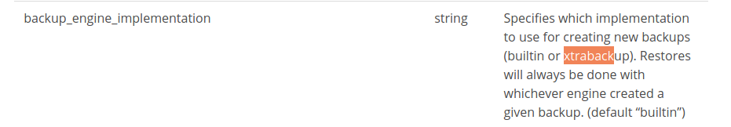
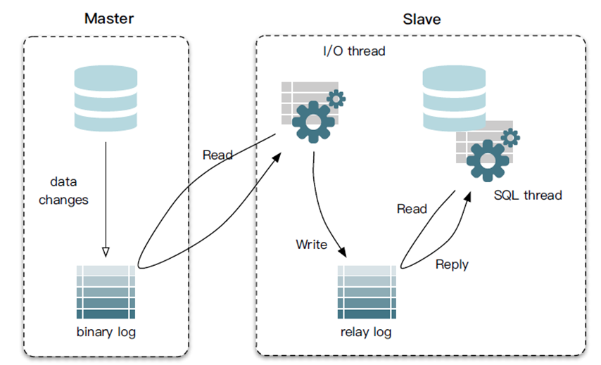
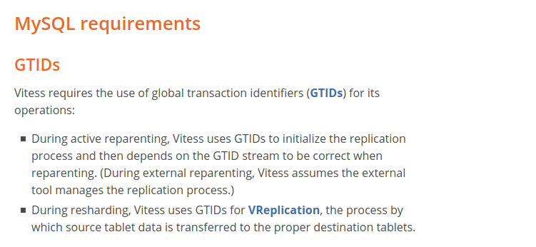
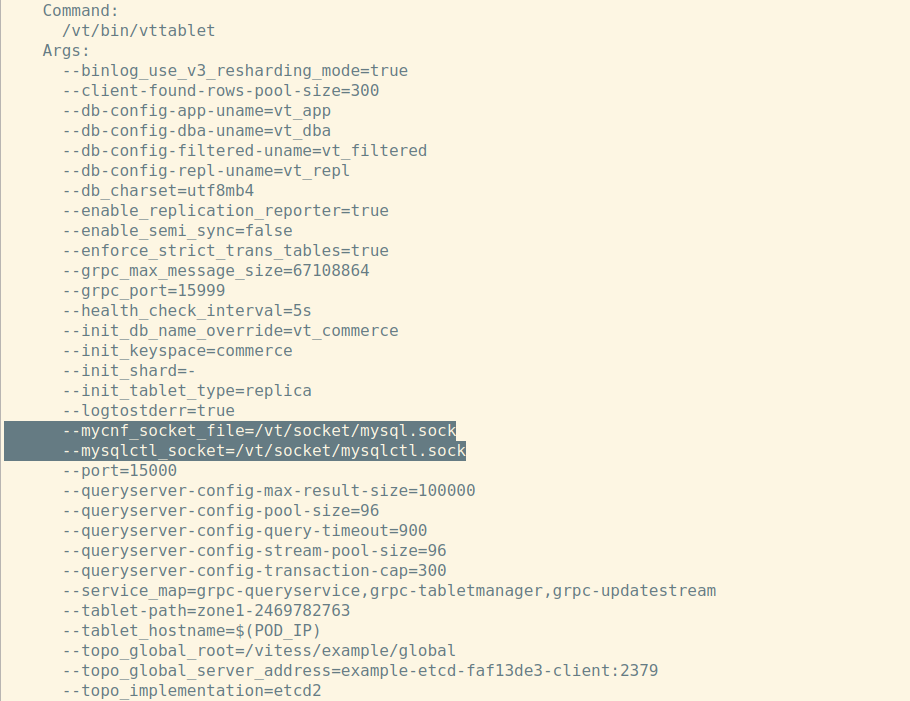
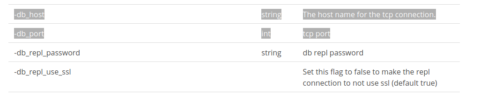

# Mysql基础点总结 - Vitess基本操作解析

## 1，关于基础主备的几个知识点。
Mysql几乎所有的高可用架构，都直接依赖于 binlog。并且都是从一主一备演化过来。以下是针对备库的几个规范化建议操作。

1，建议把节点的备库设置为只读（readonly）模式。这样在主备切换时可以避免双写Bug。

2，可以用 readonly 状态，来判断节点的角色。

3，readonly 设置对超级 (super) 权限用户是无效的，而用于同步更新的线程，就拥有超级权限，这样主备同步就没有问题。


## 主备数据同步原则，介绍以下两种。 

   Vitess支持以下两种主备同步方式，默认第二种; 在虚拟机安装方以及k83-helm方式采用了mysqlctl组件封装了以下操作。

   
   
1，基于XtraBackup同步。
   
   通用的Mysql备份工具：XtraBackup，将Master节点的数据备份到指定目录，执行过程包括以下几个步骤。

- 第一步：通过 XtraBackup 将Master节点的数据备份到指定目录。
```text
    # xtrabackup --prepare --target-dir=/var/lib/mysql
    这一步会自动在目标目录里生成一个备份信息文件，名叫：xtrabackup_binlog_info，这些信息会在接下来配置 Slave 节点的时候用到。
    
    # cat xtrabackup_binlog_info
    TheMaster-bin.000001 481
```

- 第二步：配置 Slave 节点。
  
  在第一次启动前，需要先把 Master 节点的备份数据，连同备份信息文件，一起拷贝到自己的数据目录（/var/lib/mysql）下。然后，我们执行这样一句 SQL：
```text
    mysql> CHANGE MASTER TO 
           MASTER_HOST='$masterip', 
           MASTER_USER='xxx', 
           MASTER_PASSWORD='xxx', 
           MASTER_LOG_FILE='TheMaster-bin.000001', 
           MASTER_LOG_POS=481;
```

- 第三步，启动 Slave 节点同步线程。
```text
    mysql> START SLAVE;
    
    备库会使用备份信息文件中的二进制日志文件和偏移量，与主节点进行数据同步。
    备库与主库之间将维持一个长连接。主库写入一个事务完成，当即向从库发送。
```


基于StatefulSet + XtraBackup实现的"一主多从"有状态架构方案: !(https://github.com/oracle/kubernetes-website/blob/master/docs/tasks/run-application/mysql-statefulset.yaml)


2，基于binlog的增量同步方式。 vitess通过 mysqlctl组件屏蔽了以下的操作，并且作为默认的backup同步方案。

   基于binlog， 让数据库恢复到任意一秒的状态，应用方式如下。
当需要恢复到指定的某一秒时，比如某天下午两点发现中午十二点有一次误删表，需要找回数据，可以这么做：

- 首先，找到最近的一次全量备份（通过 mysqldump --single-transaction备份出来的数据），比如昨天晚上的一个备份，从这个备份恢复到临时库；

- 然后，从备份的时间点开始，将备份的 binlog 依次取出来，重放到中午误删表之前的那个时刻。

```text
    第一步： 在master节点上执行：
    mysql > show master status;
            这里可以得到  File 以及 Position。作为下面备库的参数传入。
    
    第二步： 在 备库执行：
    mysql > CHANGE MASTER TO 
            MASTER_HOST='$masterip', 
            MASTER_USER='xxx', 
            MASTER_PASSWORD='xxx', 
            MASTER_LOG_FILE=[FILE], 
            MASTER_LOG_POS=[Position];
            
    第三步： 在 备库执行：
    mysql > START SLAVE;
    
    
    这里面解释几个点：
    1，MASTER_LOG_FILE， MASTER_LOG_POS代表备库从这个日志文件的这个位置读取binlog，需要保证在这个位置(position)之前的数据都已经存在于 备库中。
    2，在主库（master节点）执行
       > show variables like "log_bin"; 确保binlog功能已经打开。
       > show master status;  查看当前主机binlog状态。
    3， binlog执行流程：
        - 备库连接上Master，将上面的请求文件以及Pos位置发送到Master节点。
        - Master节点收到相关请求，将按照 文件以及Pos 之后的日志返回给备库, 以及这一个阶段返回给备库的 MASTER_LOG_FILE以及MASTER_LOG_POS。
        - 备库 Read这些日志 并且 Exec这些日志， 并且将 上面的 MASTER_LOG_FILE以及MASTER_LOG_POS写回本地的master-info信息，用于再次像Master节点发送 请求文件以及请求位点。
    4， 在vitess里面初始化过程中，往往是以一个空的数据库为同步的起始点，再进行后续的增量同步。
```




## vitess主备切换原理。

  以下几条命令是将备库zone1-100 切换为主库的命令。
```text
    用法：
    # vtctlclient InitShardMaster [-force] [-wait_slave_timeout=<duration>] <keyspace/shard> <tablet-alias>

    示例：
    # vtctlclient InitShardMaster -force commerce/0 zone1-100
    
    
```

1， 可靠性优先策略。 存在一定时间的系统不可用风险。这种高可用架构严重依赖于seconds_behind_master。
   
   seconds_behind_master: 主备延迟时间，含义是 主库写入binlog的时间点，备库执行完成redo log的时间点，这两者的差值，单位是 “秒”。 
```text
    备库执行以下命令获取：
    show slave status;
```
   
- 判断备库 B 现在的 seconds_behind_master，如果小于某个值（比如 5 秒）继续下一步，否则持续重试这一步；

- 把主库 A 改成只读状态，即把 readonly 设置为 true；

- 判断备库 B 的 seconds_behind_master 的值，直到这个值变成 0 为止；

- 把备库 B 改成可读写状态，也就是把 readonly 设置为 false；

- 把业务请求切到备库 B。


2， 可用性优先策略。付出的代价，就是可能出现数据不一致的情况。
- 把备库 B 改成可读写状态，也就是把 readonly 设置为 false；
- 把业务请求切到备库 B。
- 把主库 A 改成只读状态，即把 readonly 设置为 true；

  这里面可能存在的问题是在切换的时机，主备存在延迟，将会出现下图的不一致情况。
  
  在设置了 binlog_format=row的情况下，两边的主备同步的应用线程会报错 duplicate key error，同步线程停止，这时候需要手工补偿操作。
  
  **注意:** Mysql一旦遇到同步冲突（比如主键冲突，删除数据时找不到行），就会终止同步； 只有通过 "start slave;"命令才可以继续开启同步线程。
   


3， 解释 vitess中重要组件 vtctl的几个重要参数含义。
```text
   1, vtctlclient InitShardMaster 
      -force参数: 将选择 “可用性优先策略”： "WARNING: this could cause data loss on an already replicating shard"
      
      -wait_slave_timeout=<duration>: 将会等待一段时间等待备库赶上进度，再进行切换，但依然无法完全解决问题。
      
      
   2, vtctlclient PlannedReparentShard -keyspace_shard=<keyspace/shard> [-new_master=<tablet-alias>] [-avoid_master=<tablet-alias>]
      选择 ”可靠性优先策略“， 依赖于seconds_behind_master这个系统可用时间的约束: 
      -new_master： 目标新master。
      -avoid_master: 老master。
      
      
   3, vtctlclient EmergencyReparentShard -keyspace_shard=<keyspace/shard> -new_master=<tablet alias>
      当前主库已经宕机，直接选择一个备库作为新的主库。数据不完整风险必然存在。
```


4， 主备切换不存在完美的解决方案。


## 一主多从架构下的主备切换注意事项 - GTID。（vitess默认推荐一主一从一备）。
如下图所示，一主多从结构在切换完成后，A’会成为新的主库，从库 B、C、D 也要改接到 A’。


真正的主备切换操作到底该怎么做？一下揭示了两种方案（当然 vtctlclient命令就封装了以下的操作）：

1，通用的方法：基于位点的主备切换。

第一步：通过 “change master” 命令把节点 B 设置成节点 A’的从库。
```text
  CHANGE MASTER TO 
  MASTER_HOST=$host_name 
  MASTER_PORT=$port 
  MASTER_USER=$user_name 
  MASTER_PASSWORD=$password 
  MASTER_LOG_FILE=$master_log_name 
  MASTER_LOG_POS=$master_log_pos 
```

这里的MASTER_LOG_FILE就是主节点日志，MASTER_LOG_POS就是同步的日志位置（偏移量）。


2， 上面确定 MASTER_LOG_POS值必然是模糊的，为了不丢失数据，这个数值往往会多往前偏移少量数值。如何解决这个问题。

**问题的解决通过 GTID来进行处理。**
   
   GTID 的全称是 Global Transaction Identifier，也就是全局事务 ID，是一个事务在提交的时候生成的，是这个事务的唯一标识。它由两部分组成，格式是：
```text
   GTID=source_id:transaction_id
   
   source_id 是一个实例第一次启动时自动生成的，是一个全局唯一的值；
   transaction_id 是一个整数，初始值是 1，每次提交事务的时候分配给这个事务，并加 1。
```
   
   GTID在Mysql binlog(row格式)日志中的格式如下所示：


**这样，每个 MySQL 实例都维护了一个 GTID 集合，用来对应“这个实例执行过的所有事务”。**


3， 利用GTID进行主备切换。

  在 GTID 模式下，备库 B 要设置为新主库 A’的从库的语法如下：
```text
  CHANGE MASTER TO 
  MASTER_HOST=$host_name 
  MASTER_PORT=$port 
  MASTER_USER=$user_name 
  MASTER_PASSWORD=$password 
  master_auto_position=1
  
  #其中，master_auto_position=1 就表示这个主备关系使用的是 GTID 协议，在此模式下，就不需要
  “位点方法”，从库 B、C、D 只需要分别执行 change master 命令指向实例 A’即可。
  
  
  start slave;   #开启同步线程。
```

假设 实例 A’的 GTID 集合记为 set_a，实例 B 的 GTID 集合记为 set_b。

在实例 B 上执行以上命令，取 binlog 的逻辑是这样的：

- 实例 B 指定主库 A’，基于主备协议建立连接。
- 实例 B 把 set_b 发给主库 A’。
- 主库A' 计算两个集合的差集（set_a - set_b）。
- A’从自己的 binlog 文件里面，找出第一个不在 set_b 的事务，发给 B。
- 之后就从这个事务开始，往后读文件，按顺序取 binlog 发给 B 去执行。注意，这里B记录的 "GTID号码" 就不是AUTOMATIC的，而是当前主库 A’生成的。

- 这里面有个注意点： 这里切换过来的主库A' 还需要保证 差集（set_a - set_b）存在与A' 中，如果不存在，则主备同步备库的操作将会失败。
  
  也就说在 vitess中，执行 "vtctlclient InitShardMaster" 是不一定会成功的。
  
  
**总结**: 对比 “按照位点”以及“按照GTID”的方式， “按照位点”是备库决定从哪个位置开始同步数据； “按照GTID”是由主库来做决定发送同步日志。
  

vitess采用了 GTID做 reparent，也就是上面的相关原理。要求Mysql5.6版本以上。 
并且要求Mysql在启动时加上参数 gtid_mode=on 和 enforce_gtid_consistency=on， 设置GTID模式为启动状态。




## Vitess云原生方案

1，是否需要 Orchestraction组件作为协调者，作用是一旦主库挂了，则选择一个备库重新作为主库。
  
  实际上通过Operator方式，已经能够确定Master节点，即使Master节点出现问题是可以被重新调度的，但是这里面可能存在一个业务系统写操作不可用时间段；
  
  此外，还需要考虑的一个因素是主库本身的数据出现问题或者损坏，需要切换一个备库来作为主库。这是依然建议通过手动执行 "vtctlclient" 相关命令执行切换，将具体流程控制在自己手里。 
  
  
2，对于数据库是选择部署在集群内还是部署在集群外部。

- vttablet与mysql实例同时存在于一个pod内部，共享一个socket文件进行通信，这是operator推荐的做法。
  
**优势**: 1，性能。    2，管理上的一致性。

**劣势**: 1，mysql也作为有状态应用部署在集群内部，复杂度较高。    
2，需要额外的PV，PVC体系进行数据持久化。增加了风险以及复杂度。




- 剥离出数据库实例，可以采用外部数据库，比如RDS。

**优势**: 剥离出Mysql在集群外部，复杂度低。

**劣势**: 1，性能存在瓶颈。    2，不符合云原生一致性管理。


