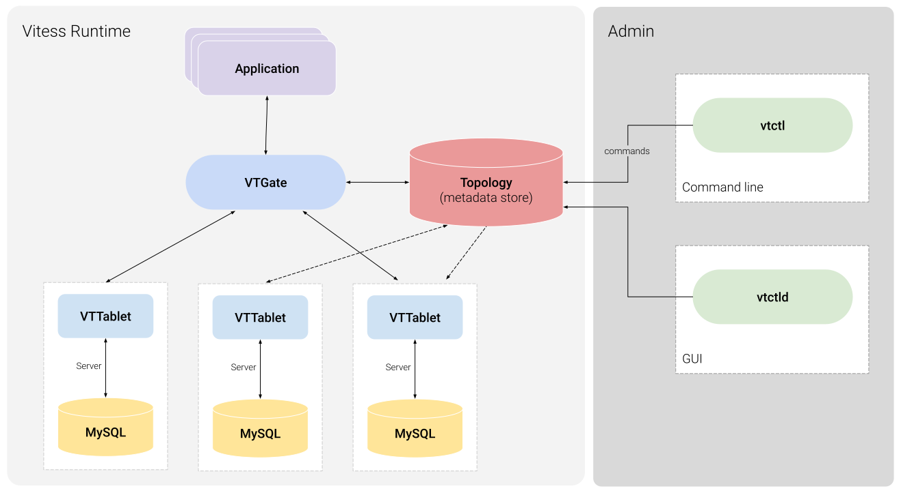

# Vitess云上方案注意事项。

## 最低限度保证-数据存储。
1， 要求选择稳定合理的云盘。在此数据基础上再进行灾备加一层保险。

2， 如果要求集群使用PV/PVC 体系，对PV/PVC的管理必须严格把控。

  当前PV采用的是“Retain”回收策略，也就是说，如果PV被删除，数据还是存在的。PVC通过有状态管理能够确定唯一的名称。但是与PV的绑定存在随机性。
  因此后期选定了云盘之后，会通过一些代码逻辑来做相关控制。
  
3， 拓扑数据存储 以及 业务数据存储。
- 参考具体目录。
- 拓扑数据可以放到集群外部存储，方案待定。
  
4，风险点考量。
- PVC PV错乱（体现在主备错乱），能够快速从备份数据恢复过来。
- 业务停机维护时间。  
  
  
## 部署规划。
1，最优解。
&nbsp;&nbsp;  建议能够通过独立的机器来运行vitess相关应用。
   
2，流量考虑。
- 一般建议主库对应的Pod和从库对应的Pod通过“亲和性”分离开，部署在不同的机器上。
- 涉及分片的数据库也按照流量以及重要程度以及影响程度部署在不同云上主机上。
- 确保主机资源富足。这里也涉及到监控方面以及业务层面，k8s机制是一旦资源不足会进行重新调度或者一些配置会进行OOM强杀，这样会带来很多不可控因素。

3，vtgate的高可用以及角色划分。

- 业务侧单独有自己的vtgate层。 管理侧单独有自己的vtgate层。

- 通过不同的service划分。

## 监控指标。
1, 基础能力。
CPU， 内存， 磁盘， 网络

2，细化指标。

## 应急预案。
**需求**: 
要求在测试环境按照产生环境1比1模拟，数据规模达到一定量级（合理能够有千万级别）。经过一段时间的调试验证后，
发现问题，归纳风险点，总结归纳成为“风险预案”

## 灾难恢复演练。

## 安全以及权限。
1， 端口安全问题。

&nbsp;&nbsp; 15999端口 -> vtctl组件（vtctlclient执行命令）使用;
  
&nbsp;&nbsp; 3306端口 -> 用于业务侧连接mysql或者客户端工具连接Mysql。
  
&nbsp;&nbsp; 15000端口 -> 用于web界面访问管理界面。

2， 集群状态变更涉及的yaml文件审核流程。
&nbsp;&nbsp; 通过[101_initial_cluster.yaml](./101_initial_cluster.yaml)，
[201_customer_tablets.yaml](./201_customer_tablets.yaml)，[302_new_shards.yaml](./302_new_shards.yaml)这些yaml文件的提交来进行vitess集群状态的变更，
这些文件必须经过严格审核，一旦配置出错，将会损坏整个集群。