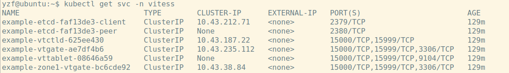
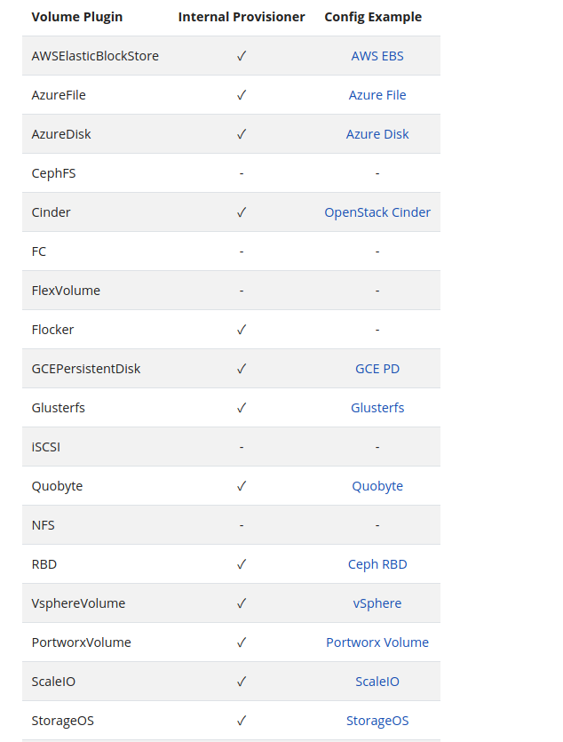
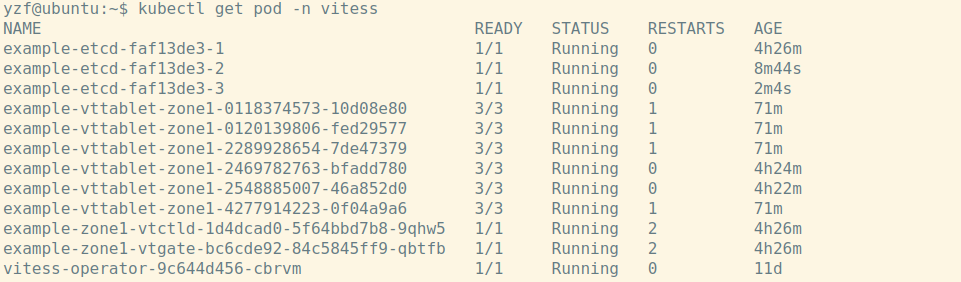

# Vitess-operator部署方案


## 部署operator。 - 形成控制器运行环境。
&nbsp;&nbsp;  这一步主要分为两大步骤，一是形成CRD资源，二是部署operator控制器。部署文件位于[operator.yaml](./operator.yaml)。
```text
   // 部署只需要执行：
   # kubectl apply -f operator.yaml
   
```
  
- 1， operator.yaml包括的CRD资源。

（1）vitessclusters.planetscale.com。
   
   通过这个CRD对象描述整个Mysql集群的信息，包括指定集群 cell信息、keyspaces信息。（keyspaces包含了单一分片数据库的主备从整体）。
   
   一般初始化vitess集群通过首先创建这个VitessCluster-CR对象来创建集群。
   
   
（2）etcdlockservers.planetscale.com。
   
   提供Topology存储的能力，存储整个集群的拓扑数据，包括分库分表路由信息、分片状态等。
   
   一般选用Etcd作为存储，在生产级别部署过程中，关注 spec.validation.openAPIV3Schema.affinity 属性，这种亲和性配置参照k8s原生亲和性配置，尽量部署在不同的主机上。
   
   
（3）vitessbackups.planetscale.com

   描述了vitess后端存储的相关配置。
   
   
（4）vitesscells.planetscale.com。

   对应vitess概念中的cell配置模式。可以在vitessclusters.planetscale.com中可以进行统一配置。
   
   
（5）vitesskeyspaces.planetscale.com.

   对应vitess概念中的keyspace配置模式。可以在vitessclusters.planetscale.com中可以进行统一配置。
   
   
（6）vitessshards.planetscale.com。

   对应vitess分片配置的相应yaml模板。
   
   
- 2， Operator-Deployment部署。
  
&nbsp;&nbsp; 源码具体参见： [http://gitlab.yzf.net/rancher/vitess-operator](http://gitlab.yzf.net/rancher/vitess-operator)
  
  
## 创建 VitessCluster对象初始化集群
```text
   # kubectl apply -f 101_initial_cluster.yaml
   
   // 部署完成后，查看相应Pod状态。
   # kubectl get pod -n vitess
     此时可以查看到 Etcd集群，对应3个实例Pod。
        2个vttablet-mysql Pod实例，对应1主1备。
        vtctld-Deployment Pod实例。
        vtgate-Deployment Pod实例。
        vitess-operator Pod实例。
        
   //查看 svc服务状态。如下图所示
   # kubectl get svc -n vitess
     其中 “example-etcd-faf13de3-peer”以及“example-vttablet-08646a59”这两个HeadleassIP用于代理Etcd以及相应的Mysql实例，作为有状态服务发现。
     其他几个service组件对应相应的组件。

```


- 关注这里的 spec.keyspaces.partitionings.equal.shardTemplate.tabletPools.dataVolumeClaimTemplate
以及 spec.globalLockserver.etcd.dataVolumeClaimTemplate， 

&nbsp;&nbsp; 这里面按照k8s-API对象指定了PVC的类型。
要求集群能够提供 Dynamic Provisioning 的持久化存储能力。  
k8s内置支持的持久化能力参见下图（其中勾选的代表内置了Dynamic Provisioning能力）。



- 通过 spec.keyspaces.partitionings.equal.shardTemplate 初始化定义vitess集群的规模以及架构。当前例子为1主1备。

&nbsp;&nbsp;&nbsp; 另一个可选方案是 "spec.keyspaces.partitionings.custom"，这将会自定义分片相关信息。
  
  解释以下几个关键字段的含义：  
  
    - spec.keyspaces.partitionings.equal.shardTemplate.databaseInitScriptSecret: 初始化的数据库脚本，主要是一些用户权限创建。
    - spec.keyspaces.partitionings.equal.shardTemplate.tabletPools： 这是一个数组值。
    - spec.keyspaces.partitionings.equal.shardTemplate.tabletPools.type： 指定当前节点类型，可选项为 "master"、"replica"、"readonly"。
    - spec.keyspaces.partitionings.equal.shardTemplate.tabletPools.replicas： 规定生成的keyspace中mysql实例的数量。
    - spec.keyspaces.partitionings.equal.shardTemplate.tabletPools.vttablet:  指定vttablet相关信息。
    - spec.keyspaces.partitionings.equal.shardTemplate.tabletPools.mysqld：    指定mysqld相关信息
    - spec.keyspaces.partitionings.equal.shardTemplate.tabletPools.dataVolumeClaimTemplate： 对应k8s的PersistentVolumeClaim定义，重点需要指定storageclass。


- Secret对象。
&nbsp;&nbsp; 实例代码 [101_initial_cluster.yaml](./101_initial_cluster.yaml) 中的“example-cluster-config”。

包含了2个key，其中 “users.json”设置了访问vtgate数据库准入密码。

“init_db.sql”设置了数据库初始执行脚本。
  

## 暴露端口。
  
 vtgate组件提供了:
 
&nbsp;&nbsp; 15999端口 -> vtctl组件（vtctlclient执行命令）使用;
  
&nbsp;&nbsp; 3306端口 -> 用于业务侧连接mysql或者客户端工具连接Mysql。
  
&nbsp;&nbsp; 15000端口 -> 用于web界面访问管理界面。
  
1， 集群内部服务访问Mysql实例。
  
&nbsp;&nbsp;  通过vtgate的代理service访问vtgate服务，此service对应域名 “example-vtgate-ae7df4b6.vitess.svc.cluster.local”。 在应用程序中指定此域名即可访问mysql服务。

2， 集群外部访问vtgate并且进行管理员操作。
  
- 可以通过Ingree暴露。

- 本地调试通过执行 [pf.sh](./pf.sh)。


## 初始化集群，数据同步。

1， 第一步，创建VSchema元数据信息。这对应了数据库中的表信息。
```text
   # vtctlclient ApplyVSchema -vschema="$(cat vschema_[database]_initial.json)" commerce
```

2， 第二步，创建Schema初始数据库以及相应数据。
- 如果存在导出的数据层面的sql脚本。可以执行以下命令：
```text
   # vtctlclient ApplySchema -sql="$(cat [database].sql)" commerce
```

- 同时也可以通过cannal+outter工具导入。目前的数据采用此方式导入。


3， 注意。

&nbsp;&nbsp; 上述的“commerce”要求与 "VitessCluster"对象 spec.keyspaces.name保持一致。

## 垂直拆分。
&nbsp;&nbsp; 这里的垂直拆分，是将数据库中的大表拆分出来，作为独立的keyspace运行。例子中另外一个名称为customer的keyspaces。

```text
   //  在执行此命令之前需要准备好PV。
   # kubectl apply -f 201_customer_tablets.yaml
     注意这里仅仅添加了customer的yaml定义，其他位置不能变动。
         
   //  执行数据迁移
   # vtctlclient MoveTables -workflow=commerce2customer commerce customer '{"task_batch":{}, "task_batch_detail":{}}'
   
   //  将读流量切换到 customer这个keyspace
   # vtctlclient SwitchReads -tablet_type=rdonly customer.commerce2customer
   # vtctlclient SwitchReads -tablet_type=replica customer.commerce2customer
   
   // 再将写流量切换到 customer这个keyspace
   # vtctlclient SwitchWrites customer.commerce2customer
   
   // 清空数据。
   # vtctlclient DropSources customer.commerce2customer
```


## 水平拆分
 
1， 第一步，设置分片规则
```text
   执行分片规则脚本，这里严格参照格式。 这里的数据作为元数据记录到Etcd中
   # vtctlclient ApplyVSchema -vschema="$(cat vschema_customer_sharded.json)" customer
```

2， 第二步，执行分片命令规则。使用[302_new_shards.yaml](./302_new_shards.yaml)
```text
   // 这里注意， 在 spec.keyspaces.partitionings.equal.parts设置为2，代表另外启动2个keyspace存放分片数据。
   // 由于replicas数量设置为2，因此这里需要4个PV。
   # kubectl apply -f 302_new_shards.yaml
   
   # kubectl get pod -n vitess
   将会得到8个vttablet实例
```

3，第三步，执行分片命令。
```text

   // 水平分片操作
   #vtctlclient Reshard customer.cust2cust '-' '-80,80-'
   
   // 确认原来的数据 和 目标分片数据的 一致性。
   # vtctlclient VDiff customer.cust2cust
   
   // 切流量
   # vtctlclient SwitchReads -tablet_type=rdonly customer.cust2cust
   # vtctlclient SwitchReads -tablet_type=replica customer.cust2cust
   # vtctlclient SwitchWrites customer.cust2cust

```

4，第四步，资源回收。
&nbsp;&nbsp; 上面通过创建新的数据库将数据进行分片。原来的实例资源需要进行回收。
```text
   
   # kubectl apply -f 306_down_shard_0.yaml
   
```

此时集群的最终状态如下：
