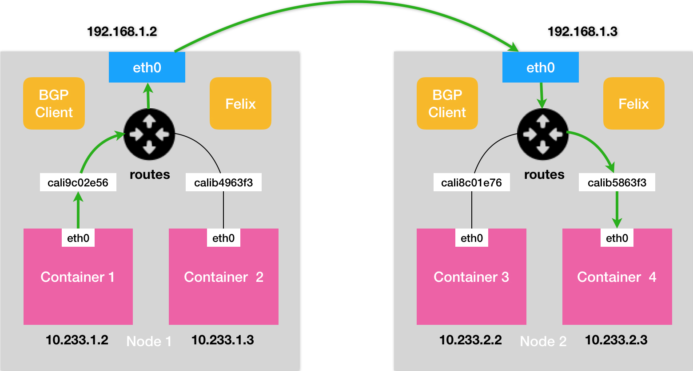

# 数据库容器化评估报告，Docker到底适不适合数据库

## 数据安全问题。
&nbsp;&nbsp; 这也是最为关键的问题，Mysql数据持久化依赖两套体系。第一个是PV/PVC体系，第二个是容器的Volumes设计体系，即Union FS镜像层提供持久化存储。
按照官方说法，如果容器崩溃。数据库未正确关闭，可能导致数据损坏。

- 折中的一套解决思路是，将备库的数据按照周期进行备份，这些备份的数据独立存放在集群外部；
备份周期依照业务重要性决定，一旦遇到问题，将备份的数据库恢复到临时库，并且从备份的时间点开始，
将备份的 binlog 依次取出来进行数据迁入。

## 网络问题。
  数据库需要专用的和持久的吞吐量，网络对于数据库的复制（主备架构，分片架构）至关重要。
  
  网络问题对于数据库系统的影响问题，也是需要关注以及解决的重要方面。在这里会做好关于网络的知识储备以及监控能力。
  
  我们采用的k8s集群网络方案是calico方案，原理如下所示：
  

## 资源隔离
Docker本质上利用CGroup实现资源限制，只能限制资源消耗的最大值，而不能够从根本上解决其他程序占用自己的资源。
当然虽然我们有k8s本身那一层Pod资源释放保证，但是这里面依然可能会出现资源不足导致Pod长期处于Pending状态但是
没有按照预期进行资源回收的问题。（比如Liunx 内核问题导致的kernel-memory-account问题，[https://github.com/kubernetes/kubernetes/issues/70324](https://github.com/kubernetes/kubernetes/issues/70324)）。

**解决方案**:
&nbsp;&nbsp;  将Mysql相关的容器部署在单独的机器上。通过亲和性避免其他业务Pod的影响。

## 总结。
1，如果需要将Mysql也通过容器化的方式部署在集群内部，那么就需要考虑以上因素。

这种方案建议优先用在数据丢失不敏感的业务上，通过收集相关经验以及验证再做后续讨论。

2，第二套方案，可以将Mysql放到集群外部部署，vitess相关组件部署在集群内部。这样的缺点在于缺少了集群动态编排的能力，
需要通过传统方式对数据库进行管理，优势在于避免了上述相关问题。

3，集群拓扑数据，目前存储在Etcd中，采用调用Stateful接口来进行管理的。通过有状态方式部署在集群内部，
这个方案Etcd官方提供了有力支撑，包括备份管理方案都比较完善。 当然也可以部署在集群外部。
